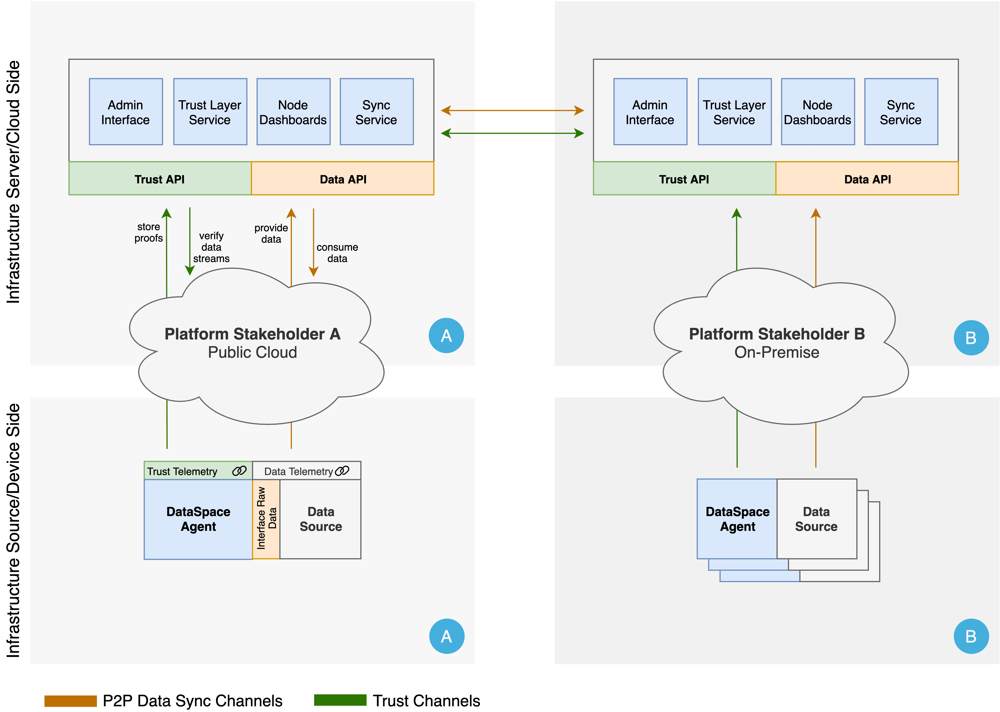

The DataSpace Kit has a distributed system topology in order to provide secure peer-to-peer connections for the data sharing process and an immutable system for the data verification capabilities.

## DataSpace Ecosystem Topology

A DataSpace Ecosystem requires a **single** DataSpace Coordinator, can have from **one to multiple** DataSpace Nodes and **one to multiple** DataSpace Agents for each node. The following topology schema outlines an ecosystem with:

- a DataSpace Coordinator
- a DataSpace Node each stakeholder & infrastructure
- a DataSpace Agent each data source

*Fig.1: DataSpace Ecosystem System Topology*

The **Tributech DataSpace Kit** is a containerized software-tool-kit that covers the whole data transfer between DataSpace Nodes (which usually represents a companies cloud or server infrastructure) and it covers the transfer of cryptographic proofs between the DataSpace Agents and the trust layer.

> **Important Note:** The DataSpace Kit doesn't influence or cover the client-server communication between devices/sources and the stakeholder's platform. The DataSpace Agent "only" transfers hashes and signatures through a dedicated publisher trust channel to his associated DataSpace Node.

### DataSpace Node

A **DataSpace Node** is acting as a gateway/broker that is required to participate in a DataSpace Ecosystem. It contains all services needed for the data exchange and data verification capabilities with other nodes inside a DataSpace ecosystem. Each DataSpace Node is controlled by a person or organization.

### DataSpace Agent

The **DataSpace Agent** is a software agent (with optional support for hardware-based key storages) to provide cross-system data security for any type of device/source like sensors, IoT-devices, IoT-gateways, SCADA-systems, PPS-systems, ERP-systems and more. A scalable process for generating cryptographic proofs and a secure connection to the trust layer guarantees the raw data’s authenticity and integrity for an entire ecosystem of DataSpace Nodes.

### DataSpace Coordinator

The **DataSpace Coordinator** provides the metadata storage and the public key infrastructure that is required for setting up an ecosystem of DataSpace Nodes. The DataSpace Coordinator is responsible for: storing the metadata of published datasets, managing public keys, the inclusion of new nodes and issuing certificates.

>**Important Note:** A DataSpace Coordinator is not on the route of the traffic of the data exchange and even a man-in-the-middle-attack would fail because >the coordinator has no private-key material of DataSpace Nodes or Agents.

### Channels and APIs

**Channels** connect the distributed components of a DataSpace Ecosystem. They can be considered as "black-boxes" which contain synchronisation processes for exchanging data. They handle the networking, data processing, authentication and encryption between the connected components. These channels are separated into:

| Channel       | Description |
| :---          |    :----    |
| **P2P Data Sync Channels**  | A channel to exchange requested streams of sensor-, processes- or business data peer-to-peer between DataSpace Nodes.|
| **Metadata Channels**    | A channel to exchange required metadata (e.g. published datasets) of the ecosystem between the DataSpace Nodes and their associated DataSpace Coordinator.|
| **Trust Channels**  | A channel to transfer hashes and signatures directly from the DataSpace Agents to the trust layer of the associated DataSpace Node.|

**APIs** are well documented and supported interfaces for the different types of data in the ecosystem in order to integrate sensors, databases and applications within the infrastructure of each participating stakeholder. These APIs are separated into:

| API       | Description |
| :---          |    :----    |
| **Data API** | This API is integrated into each DataSpace Node and provides the interface and services in order to deliver and consume data streams. |
| **Trust API** | This API is integrated into each DataSpace Node and provides the interface for the trust layer in order to consume hashes and signatures for the data verification. |

## DataSpace Node Topology

If we assume, that we have two DataSpace Nodes that are connected to DataSpace Ecosystem, we can now focus on the system topology and communication flows inside the infrastructures and verticals.

The DataSpace Node consists of different services that are required for the data sharing and data verification process and it provides well documented interfaces for the integration of different types of data sources. The following topology schema outlines a infrastucture with:

- a DataSpace Node each stakeholder
- a DataSpace Agent each data source

*Fig.2: DataSpace Node System Topology*

### Services

As shown in Fig.1, a DataSpace Node contains all the required services for the data sharing and verification capabilities of the DataSpace Kit for the integration on the infrastructure side of each stakeholder.

| Service       | Description |
| :---          |    :----    |
| **Admin Interface** | A web-interface for users of the DataSpace Node in order to manage the access of data streams via the publish-, request-, and grant workflows. |
| **P2P Sync Service** | The P2P Sync Service executes the data sharing/exchange process and also covers the networking, data processing and encryption between DataSpace Nodes. It handles the synchronization processes of data streams between the Data API, the storage system and the data consumers. |
| **Trust Layer Service** | The Trust Layer Service includes an instance of the distributed ledger, verification services, and the Trust API in order to provide the verification capabilities for data streams. By storing and providing proofs from DataSpace Agents, the Trust Layer Service can guarantee the auditability of authenticity and integrity for data streams - forever.|
| **Node Dashboards** | In addition to the Data API - Node Dashboards provides an additional option to consume data streams via dashboards, especially for members of a DataSpace ecosystem that have a lower digitalization level and do not have their own visualization system.|
