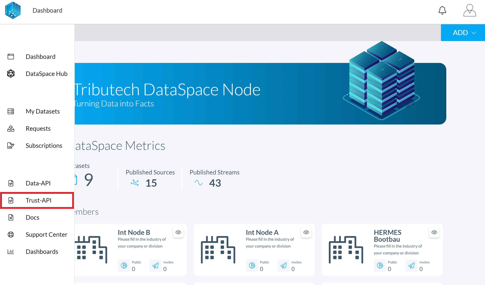
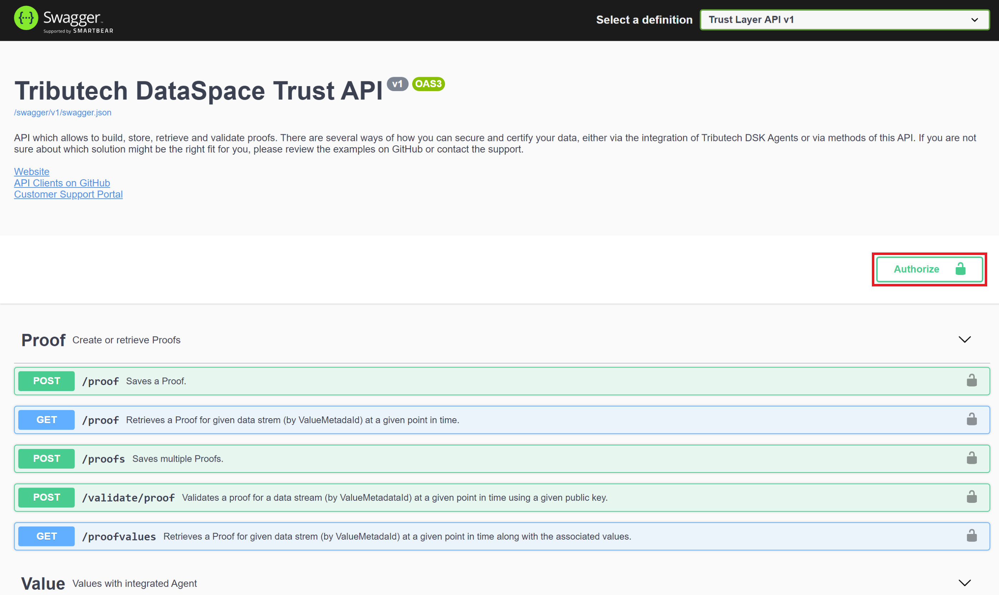
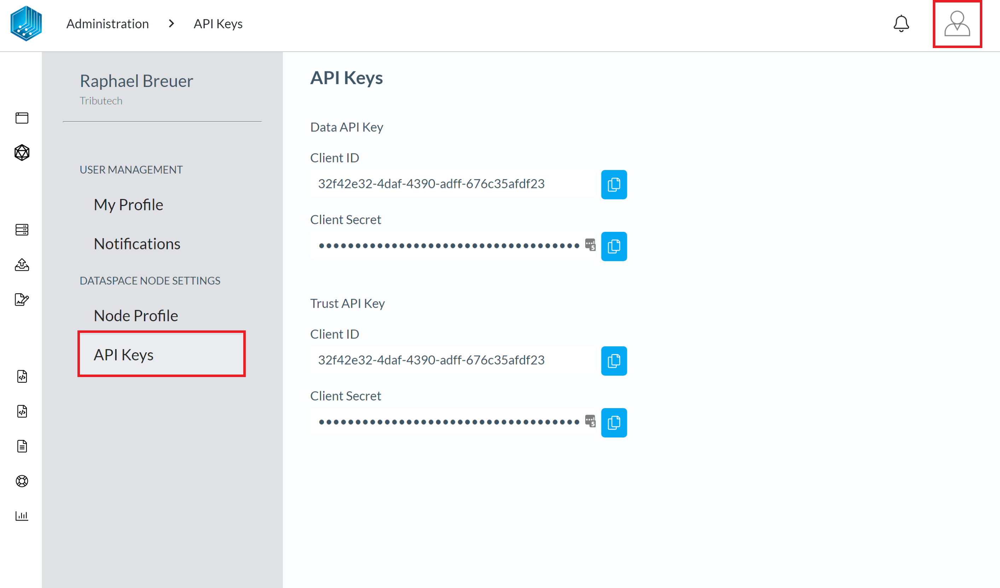

# Verify a data stream guide

In this guide you will learn how you can verify the authenticity and integrity of a data stream via the built in Trust API of your DataSpace Node. This guide covers the following topics:

- [Prerequisites](/guides/guide-verify-data-stream/#prerequisites)
- [Verfiy a stream](/guides/guide-verify-data-stream/#verfiy-a-stream)
    - [Built in verification method](/guides/guide-verify-data-stream/#built-in-verification-method)
    - [Verify data by your own](/guides/guide-verify-data-stream/#verify-data-by-your-own)

## Prerequisites

The prerequisites for verifying a data stream via the Trust API are the following:

- A DataSpace Angent is integrated into the data source (common way for example via IoT Edge Devices or the Sensor Security Module) or a data stream is stored via Trust API and the method which contains the hashing and signing process of the Agent (common way for server-side sources)
- If you own the data -> Data exists on owner side within the selected time-frame (Master DB)
- If you consume the data -> Data is already synchronised on the consumer side within the selected time-frame (Slave DB)

## Verfiy a stream

**1. Navigate to Trust API**

Afterwards you are redirected to our Swagger homepage. There you need to authorize your user first. 

**2. Navigate back to DataSpace Node web interface** 
You can find the **client_ID** and **client_secret** if you redirect to the DataSpace Node web interface click on your **user icon**. Then navigate to the **administration menu**.

**3. Authorize** 
Click on the **authorize** button, paste the **client_ID**, paste the **client_secret**, select the **full-access** checkbox and click on the authorize button.

### Built in verification

With the build in verifiaction method you can verify the integrity and authenticity of your own and consumed data streams.

**3.1 Provide Stream UUID -** Click on the method **get proof**, paste the **UUID** of your selected data stream, paste a **time-stamp** of your choice and click on the **execute** button.

**3.2 Validate Proof -** After the execution of the method, the API calculates the hash of the stored data and compares it with the hash and signature, that are stored inside the ledger of the trust layer. If your data's integrity and authenticity are successfully verified, you will see the state **true** in the response.

### Verify by your own

With the method **get proof raw**, you can consume values and verification data to verify the integrity and authenticity by your own application. Follow the instruction and try it out:

**4.1 Provide Stream UUID -** Click on the method **get proof raw**, paste the **UUID** of your selected data stream and click on the **execute** button.

**3.1 Get Values and Proof -** After the execution of the method, you will get **root hash**, the **signature** and the **values** to verify the data by your application. The following data should be provided within the response:

