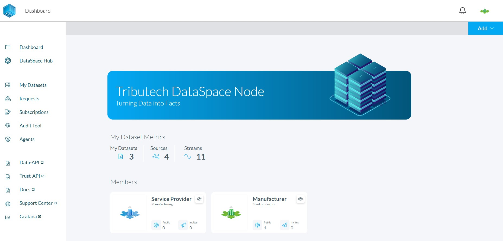

# Tributech DataSpace Kit: Architecture

As explained in the [Product Overview](./product-overview.md), the three fundamental components for the Tributech DataSpace Kit are the DataSpace Hub, the DataSpace Node and the DataSpace Agent. A closer look at these components is presented following.

### DataSpace Hub

The DataSpace Hub provides the metadata storage and the public key infrastucture that is required for setting up an ecosystem of DataSpace Nodes. In short, the Hub holds all Metadata information required for managing and organization of the secure auditable data sharing between nodes. Note that the Hub does not hold any data itself, thus guaranteeing the data soverignity of the node owners! 
Thus, the Hub is responsible for:

- storing the metadata of published datasets
- adding new DataSpace Nodes to the ecosystem
- issuing of certificates
- managing public keys
- managing identities

> Note: A DataSpace Hub is not on the route of the traffic for the data exchange and even a man-in-the-middle-attack would fail because Hub has no private-key material of DataSpace Nodes or Agents.

### DataSpace Node

A DataSpace Node is acting as a gateway/broker that is required to participate in a DataSpace Ecosystem. It contains all services needed for the data exchange and data verification capabilities with other nodes inside a DataSpace Ecosystem. Each DataSpace Node is controlled by a person or organization.

The DataSpace Node comes with an integrated Trust Layer, which ensures data auditability and guarantees the tamperproof storage of the proofs thorugh a distributed systems technology which shares the proofs across all nodes in the ecosystem.

The Dataspace Node comes with a web UI application called DataSpace Admin which allows for easy maintaining of the node and interacting with other members of the ecosystem.
The interface of the app can be seen in Fig.1.

_Fig.1: DataSpace Admin App_

With a DataSpace Node you can:

**Connect data** sources via APIs and combine selected data to datasets. The integrated web UI application DataSpace Admin provides an interface to generate the required metadata that defines a dataset. For each stream (not limited to a data format or type) a unique ID is generated which is used as a reference for the data source integration via the APIs of the Dataspace Node. Through the unique IDs from data streams of a dataset, other participants inside a ecosystem can request and consume data.

**Share data** streams with your customers, suppliers and partners. The DataSpace Node allows every user to create individual and automated synchronization processes to exchange data, without the need to care about networking, data processing, authentication and encryption between the connected systems. The integrated web application covers the data sharing process for datasets via publish, request and grant workflows.

**Audit data** by checking the origin and integrity before you start using it. Data can be audited through the integrated Audit tool of the DataSpace Admin app or through the available API. Ready more about how Tributech guarantees the security for your auditable data [here](./auditable-data.md).

**Visualize data** through the integrated Node dashboards based on the well-known and well-established Open Source technology <a href="https://grafana.com/" target="_blank">Grafana</a>.

### DataSpace Agent

The DataSpace Agent is designed for an integration into the data source for providing cross-system data security for any type of device/source like e.g. sensors, IoT-devices, IoT-gateways, SCADA-systems, PPS-systems, ERP-systems and more. A scalable process for generating cryptographic proofs and a secure connection to the trust layer guarantees the raw data’s authenticity and integrity for an entire ecosystem of DataSpace Nodes.

_Fig.2: DataSpace Agent Schema_

The DataSpace Agent enriches a data source in terms of security and reliability. In addition to the existing data telemetry, hashes and signatures are created for each data point/packet/portion and these proofs are transmitted via a dedicated authenticated and encrypted communication channel to the trust layer.

The DataSpace Kit has a distributed system topology in order to provide secure peer-to-peer connections for the data sharing process and an immutable system for the data verification capabilities.

## Next steps

- Learn more about Tributech creates [auditable data](auditable-data.md)
- Set up a demo of the product through our [quick start guide](../quickstart/overview.md)
