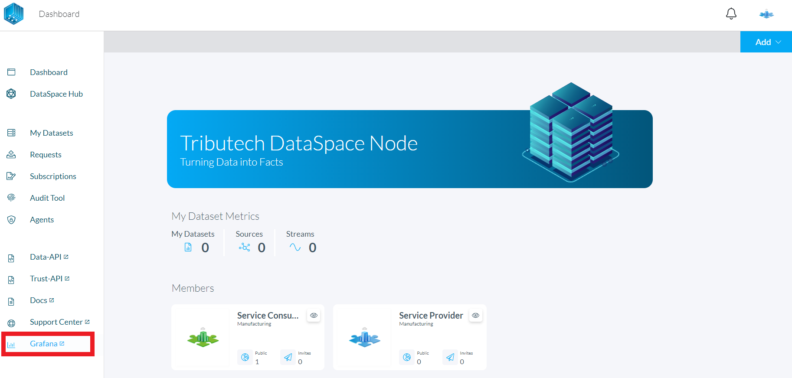
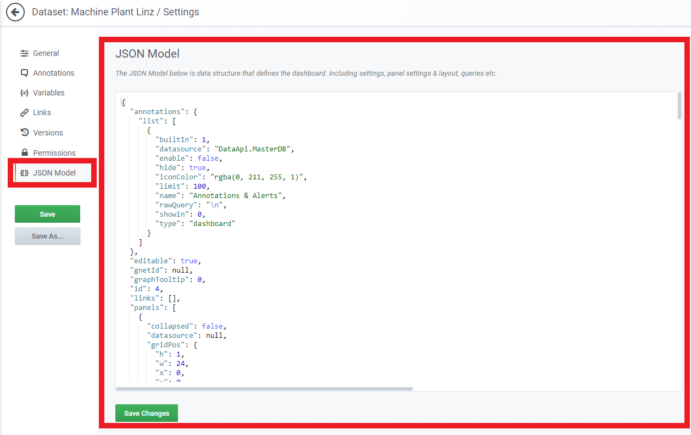

# Consume data via dashbaords

In this guide you will learn how you can consume your own Datasets and your Subscriptions via the built in dashboards of your DataSpace Node.

This guide is layed out for the data streams in the Quick start guide, although creating dashboards for other data streams should follow the same principle, just end up with a slightly different configuration, depending on the needs.

### Prerequisites

The prerequisits for consuming data from a Subscription via the integrated Dashboards are, that a Dataset must be available at your node.  
If you followed the Quick Start guide, then those prerequisites should be fulfilled.

This could be in one of two ways:

- You are **Data Owner**: You own some Datasets and have your own data on your node (Owner DB)
- You are **Data Consumer**: You have been granted a Subscription to a Dataset and the data is already synchronised to your node (Consumer DB)

### Node Dashboard Basics

You can easily navigate to your node dashboard by clicking the "Grafana" menu entry in the side menu of your DataSpace Admin App.
For authentication, use the same username and password that you use for authentication when accessing the DataSpace Admin App.

The dashboarding system is built on the open source technology <a href="https://grafana.com/" target="_blank">Grafana</a>. It comes with pre-configured data sources for the in your DataSpace Node integrated Postgre SQL databases.

The structure of dashboards is based on the same logic as in the interface of your DataSpace Node:

- **Dashboards: My Datasets** / Owner DB - contains owned Datasets that are connected to your DataSpace Node.
- **Dashboards: Subscriptions** / Consumer DB - contains subscriptions to Datasets from other members of your Ecosystem.

## Create a Dashboard

To visualize your data via the dashboarding system the only thing you have to do is to duplicate the pre-configured template, paste a code snippet and paste the UUID (ValueMetadataId) of your slected data stream.

**1. Add a new Dashboard -** Click the "+" button and click on the "Dashboard" menu item to create a new Dashboard. Then click on the settings symbol to get to the Dashboard settings of the just created Dashboard, as shown below:

**2. Copy and paste the JSON Model template -** First, prepare the JSON template and adjust to your unique stream ids.

- If you are Owner, then copy the json of <a href="https://github.com/tributech-solutions/tributech-dsk-docs/blob/master/docs/assets/dashboard-templates/owner-db-template.json" target="_blank">the Owner DB JSON template</a>
- If you are Consumer, then copy the json of <a href="https://github.com/tributech-solutions/tributech-dsk-docs/blob/master/docs/assets/dashboard-templates/owner-db-template.json" target="_blank">the Owner DB JSON template</a>

Copy the contents to a editor of your choice. In the editor, paste the template JSON and search for "ReplaceWith".
There should be 4 times where you must replace the `<ReplaceWith...>` strings with the IDs of your data streams, which you can find [as described here](../../create-dataset/#successful-creation-of-the-dataset).

Finally, copy this adjusted template JSON, paste into the settings tab "JSON Model" of your new dashboard and click "Save Changes".

Optionally, you can now rename the rows / panels to your liking or just play around with your brand new dashboard!

## [Next: Consuming data via APIs](./data-via-apis.md)
