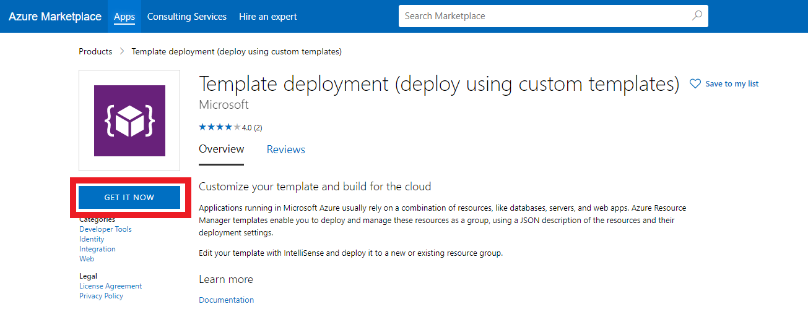
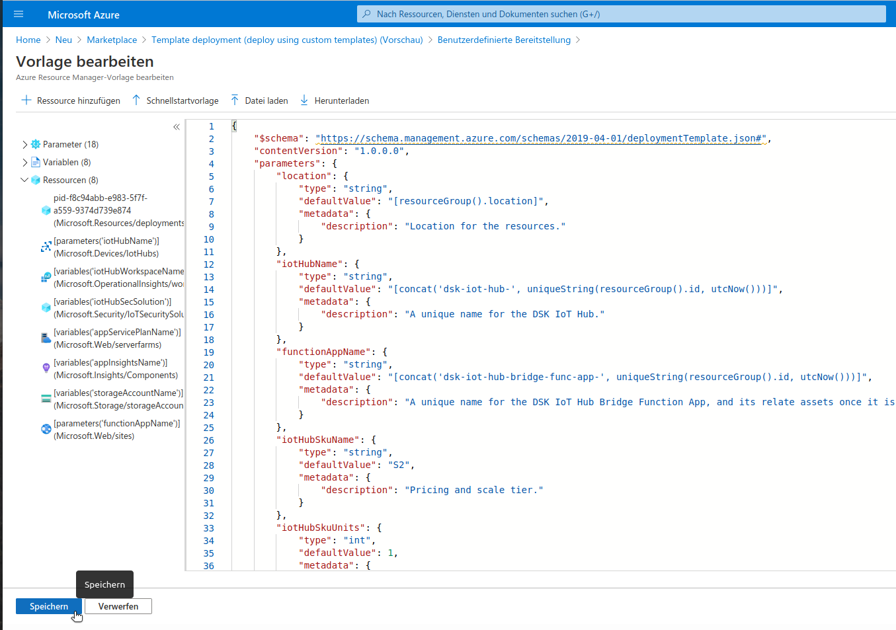
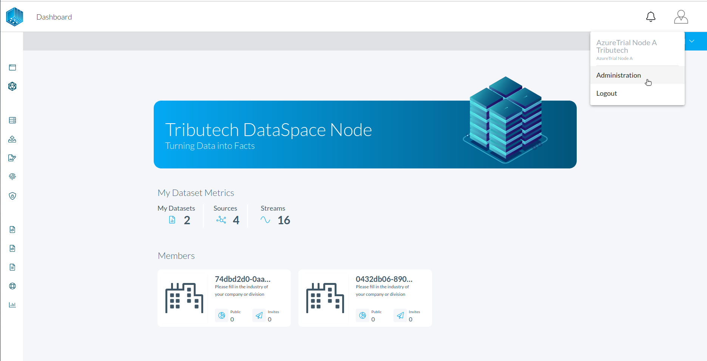
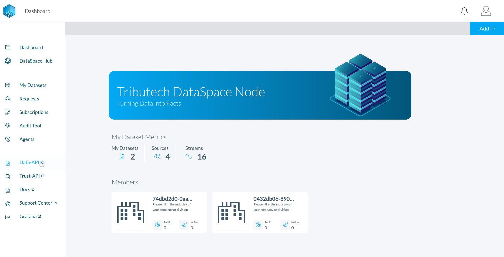
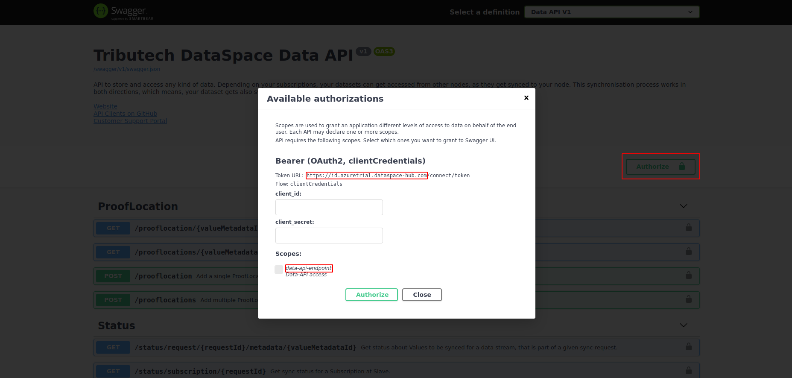
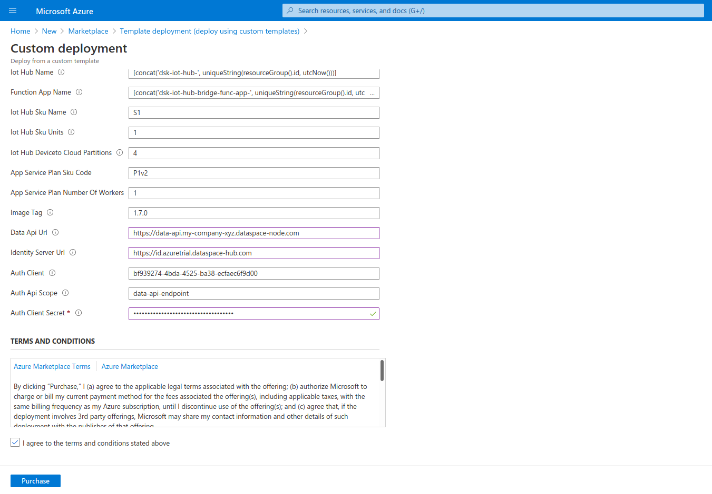

# Install DSK IoT Hub Bridge

After the node is successfully deployed we can add an instance of the Azure IoT Hub. The IoT Hub is an external service provided by Azure rather than a part of the DataSpace Kit. That is why it has to be deployed separately in order to use it.  
The IoT Hub provides Device-Management and Communication for our Edge Devices. While we use the Azure IoT Hub, it is also possible to integrate any other device management solution.

For easier deployment of the DSK IoT Hub Bridge we prepared an Azure Resource Manager (ARM) Template.

## Create a custom template deployment

### Navigate to the custom template deployment

Follow the link for the [Template Deployment](https://azuremarketplace.microsoft.com/en-us/marketplace/apps/Microsoft.Template?tab=Overview) in the Azure Marketplace and click the "GET IT NOW" Button. A dialog will open where you have to agree to the terms and conditions.

### Navigate to the template editor

Click "Build your own template in the editor" as shown below. A template editor is going to be shown.

### Copy and paste the prepared template

Copy the ARM Template that can be found <a href="https://github.com/tributech-solutions/tributech-dsk-docs/blob/master/docs/assets/iot-hub-arm-template/iotHubAndBridgeTemplate.json" target="_blank">here</a> into the editor and click "Save".

## Configure the deployment

Now you will have to configure the deployment with parameters such as Resource group, Subscription etc., but also with some more specific parameters. This part will guide you through those steps.

### General parameters

Pick the Subscription and Resource group where you would like the deployment to be. It is recommended to ceate a new Resource group for this or alternatively use the one that was previously created for the owner node deployment.  
Proceed to pick a location. As for the other settings up until including the Image Tag, the default values will most likely be fine.

### Node specific parameters

This step is crucial, make sure to get the parameters right as described following.
For the IoT Hub to be able to connect to your new node it requires credentials.
Thus, there are a number of node specific parameters which you will have to provide.

| Setting             | Value                                                                 |
| ------------------- | --------------------------------------------------------------------- |
| Image Tag           | Current version of the DSK you are using. The default is likely fine. |
| Data Api Url        | Url from the Data API                                                 |
| Identity Server Url | Token Url of the Identity Server                                      |
| Auth Client         | The Client ID                                                         |
| Auth API Scope      | Scope from the Data API                                               |
| Auth Client Secret  | The Client secret                                                     |

You can find those parameters easiest by navigating to the Data API Swagger UI and through the DataSpace Admin Administration.

#### Retrieve your node specific parameters from the DataSpace Admin App

The following settings can be found in the DataSpace Admin App.

| Setting            | Value             |
| ------------------ | ----------------- |
| Auth Client        | The Client ID     |
| Auth Client Secret | The Client secret |

In the DataSpace Admin App, navigate to the Administration as shown below.

The rest of the settings can be found in the Data API Swagger UI. The IoT Hub will use the Data API to connect to the node. Navigate to the Data API Swagger UI by following the link in the DataSpace Admin App as shown in the screenshot below.

A new tab will be opened showing the documentation of the Data-API.
The URL will be something like https://data-api.your-node-name.dataspace-node.com/. Copy and paste the URL of your Data API as the setting **"Data Api Url"**.

Next, open the Authrization dialog by clicking the "Authorize" Button in the Swagger UI.
You can find the setting **"Identity Server Url"** there through the "Token URL" parameter in the dialog. Check the screenshot below for further info.
Note that you must only take the part of the Token URL without the `/connect/token` part.

All that's missing now is the **"Auth API Scope"** setting. You can find this through the "Scopes" section at the bottom of the Authorization dialog. Note that it is only the upper value shown there, as highlighted through the red box in the screenshot below. This value will most likely be `data-api-endpoint`.

### Finalize the deployment

After inserting all the parameters and settings, click "Purchase".
The deployment will run for a couple of minutes. After the deployment is finished there should be a new instance of the Azure IoT Hub in the selected Resource group. This IoT Hub will be used in the following steps to deploy a simulated Edge Device.

---

## [Next: Setup an IoT device](./setup-device.md)
