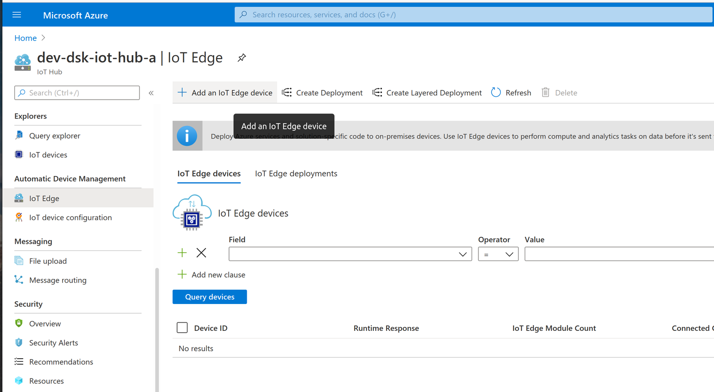
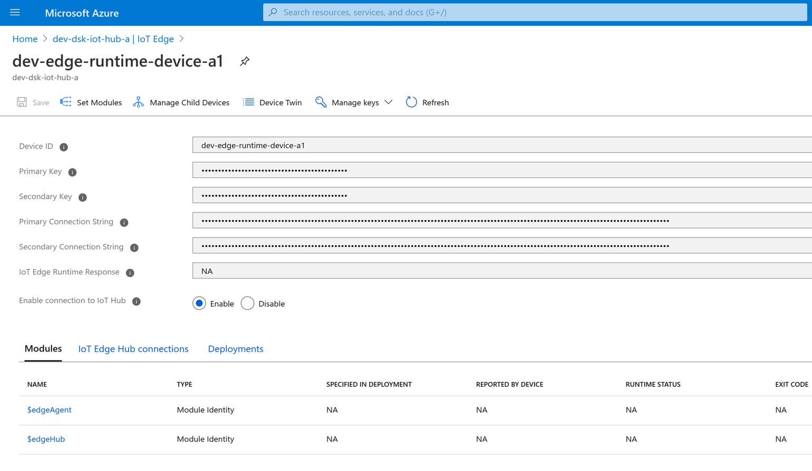
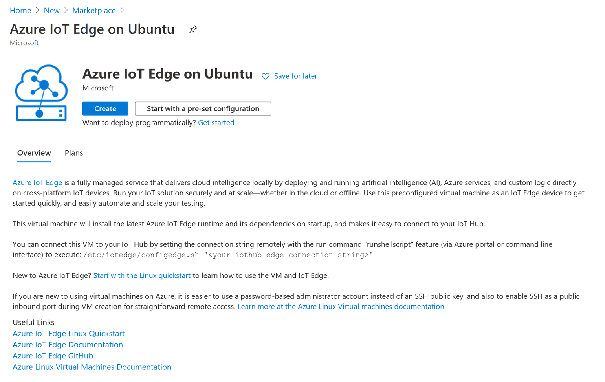
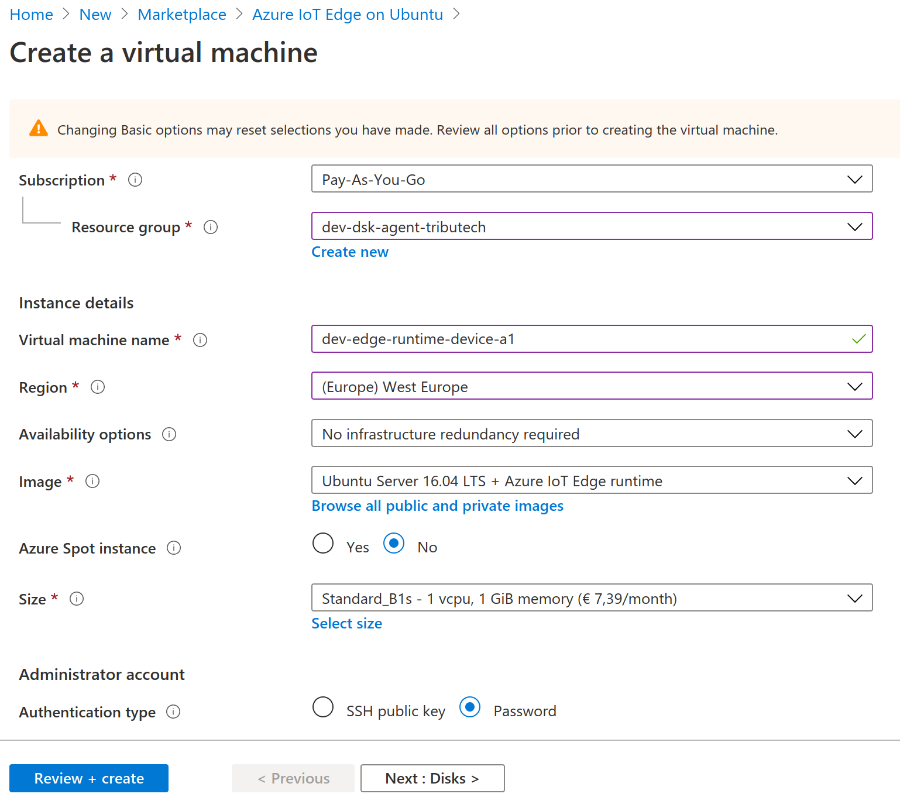
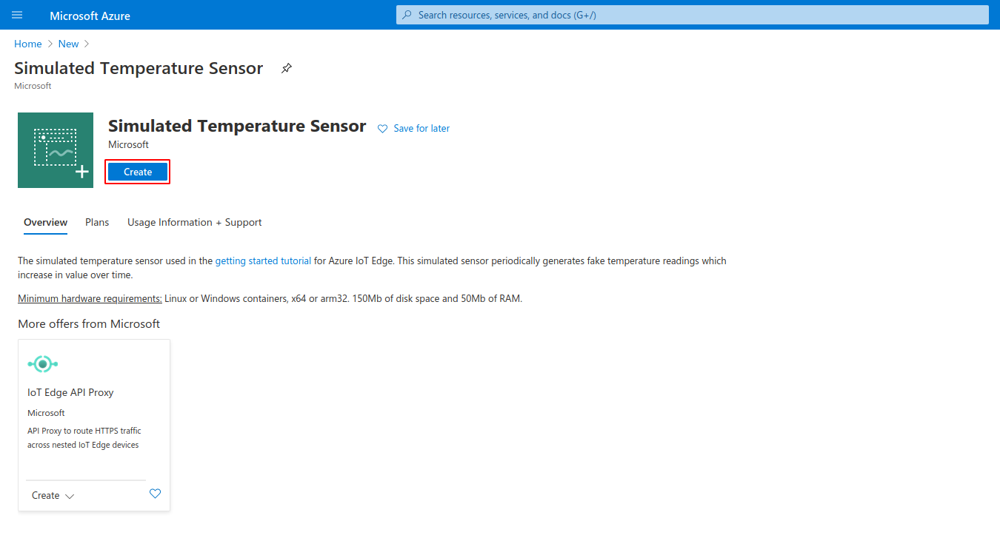
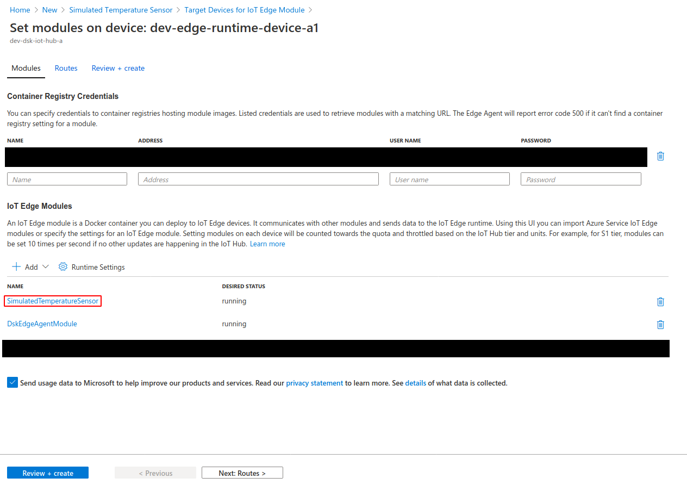
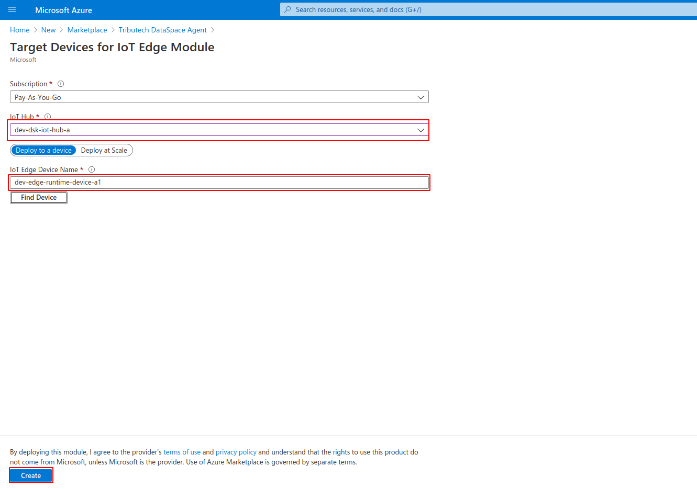
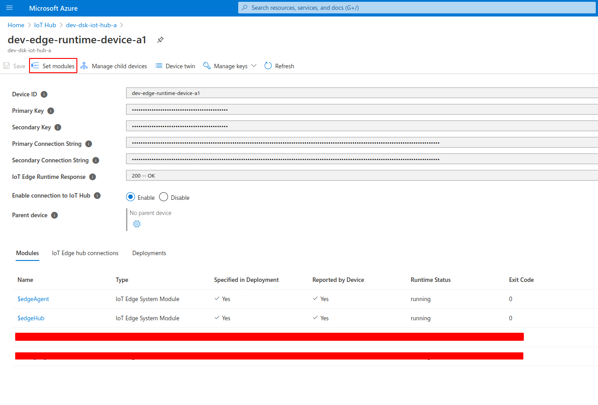
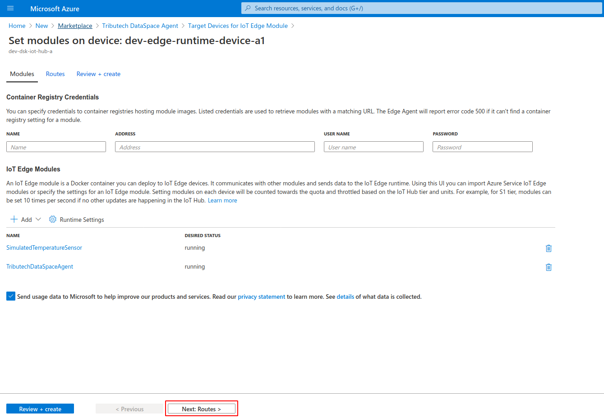
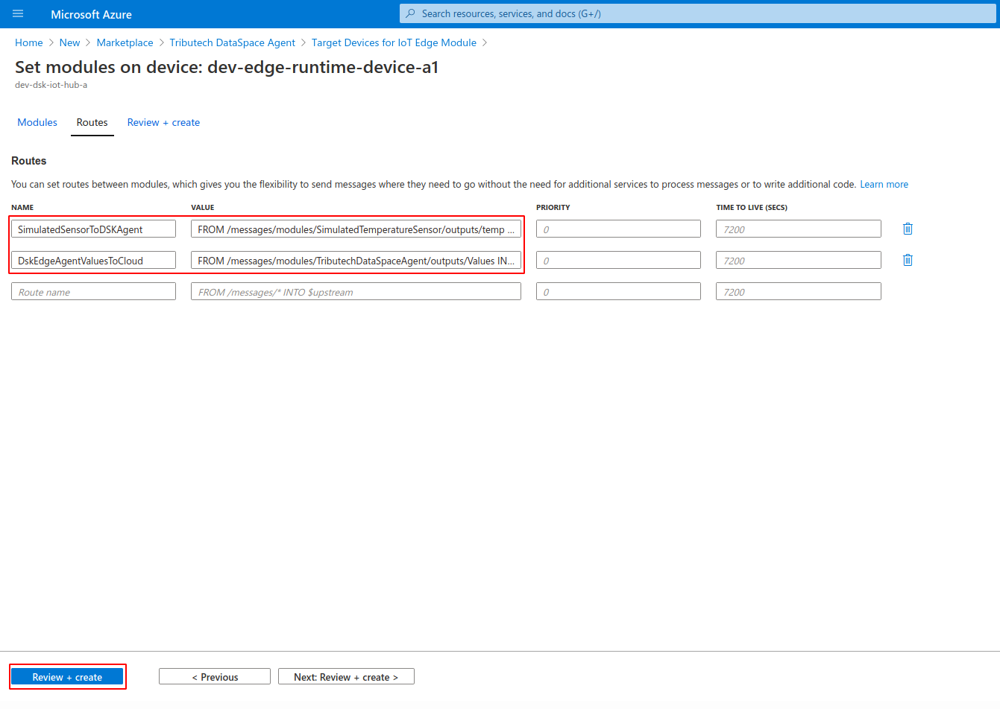

# Setup IoT Device

## Create Edge Device in IoT Hub

### Open 'IoT Edge' click 'Add Device'

### Select a name for your device

### Note the connection string

When the device is created select the new device and note the primary connection string for later steps.

## Create a VM

### Deploy simulated IoT Edge Runtime device from Azure Marketplace

Deploy a Virtual IoT Edge Runtime device from the [Marketplace](https://azuremarketplace.microsoft.com/en-us/marketplace/apps/microsoft_iot_edge.iot_edge_vm_ubuntu?tab=Overview).

The simulated Edge Runtime Device is simply an Ubuntu VM with the Azure IoT Edge Runtime installed. Choose a good name for the VM. The Size "Standard_B1s" should be fine for the purpose of this guide. If you are planning on processing large amounts of data consider using a more powerful instance.

Configure SSH so that you can log into the VM after it has been created.

After the VM has been created log into the VM via SSH and run the following commands. Use the Primary Connection String from before.

    sudo /etc/iotedge/configedge.sh "[IoT-Hub-Connection-String]"
    sudo apt-get update
    sudo apt-get upgrade -y
    sudo reboot

## Deploy Edge Runtime Modules

You will need two Azure Edge Runtime modules. A simulated source of sensor values and the DSK Agent Edge. The job of the data-source is to create simulated values. The Agent is responsible for signing the data and sending the data as well as the signatures to the DSK Node.

To be able to create signatures the Agent needs to be connected to the Trust-API of the DSK Node. It requires API-Credentials to do so. Credentials for the Trust-API can be obtained similarly to the credentials for the [Data-API](../install-bridge/#find-the-node-credentials).

### Add Simulated Temperatuer Sensor Module

The Simulated Temperature Sensor is provided by Azure IoT and can be found in the [Marketplace](https://azuremarketplace.microsoft.com/en-us/marketplace/apps/azure-iot.simulated-temperature-sensor?tab=Overview).

#### Create a new Simulated Sensor from the Marketplace

#### Select your IoT Hub and Edge Device

#### Click on the new module to open the settings

#### Set the environment variable "MessageCount" to -1 for an infinite number of sensor readings

After that click on "Update"

#### Finally click on "Review + Create" and then on "Create"

### Add DSK Agent Edge Module

The DSK Agent Edge can also be found in the [Marketplace](https://azuremarketplace.microsoft.com/en-us/marketplace/apps/tributechsolutionsgmbh1582568815297.57601ccd-62c3-4842-9f73-3dadd3de5b74?tab=Overview).

#### Create a new DSK Agent Edge from the Marketplace

#### Select your IoT Hub and Edge Device

#### Set environment variables to configure the agent

- **EdgeDeviceOptions\_\_AgentID**
  - Choose a unique string
- **ProofSinkOptions\_\_TrustAPIBaseUrl**
  - **Sample:** `https://trust-api.my-company-xyz.dataspace-node.com`
  - Trust API Url. Replace 'my-company-xyz' with the name of your node.
- **ProofSinkOptions\_\_AuthUrl**
  - **Value:** `https://id.azuretrial.dataspace-hub.com/connect/token`
  - Auth Url from before. This default should work for most cases.
- **ProofSinkOptions\_\_AuthScope**
  - **Value:** `data-api-endpoint trust-api-endpoint`
  - Auth Scope from before. This default should work for most cases.
- **ProofSinkOptions\_\_ClientID**
  - Client ID from the Node Web Interface.
- **ProofSinkOptions\_\_ClientSecret**
  - Client Secret from the Node Web Interface.
- **EdgeDeviceOptions**DataStreamID**[DataStreamID]**
  - Replace `[DataStreamID]` from the variable name with the DataStream ID generated in this [step](../create-dataset)
  - **Variables:**
    - Key: `EdgeDeviceOptions__DataStreamID__[DataStreamID]` Value: `SimulatedTemperatureSensorValueSource__0__Machine_Temperature`
    - Key: `EdgeDeviceOptions__DataStreamID__[DataStreamID]` Value: `SimulatedTemperatureSensorValueSource__0__Machine_Pressure`
    - Key: `EdgeDeviceOptions__DataStreamID__[DataStreamID]` Value: `SimulatedTemperatureSensorValueSource__0__Ambient_Temperature`
    - Key: `EdgeDeviceOptions__DataStreamID__[DataStreamID]` Value: `SimulatedTemperatureSensorValueSource__0__Ambient_Humidity`

#### Finally click on "Review + Create" and then on "Create"

### Add Routes

#### Open the IoT Hub and select the Device

#### Click on "Set Modules"

#### Click on "Next: Routes"

#### Set the routes and click create

| Name                      | Route                                                                                                                                                                  |
| ------------------------- | ---------------------------------------------------------------------------------------------------------------------------------------------------------------------- |
| SimulatedSensorToDSKAgent | FROM /messages/modules/SimulatedTemperatureSensor/outputs/temperatureOutput INTO BrokeredEndpoint("/modules/TributechDataSpaceAgent/inputs/AzureSimulatedSensorValue") |
| DSKEdgeAgentValuesToCloud | FROM /messages/modules/TributechDataSpaceAgent/outputs/ValueSink INTO $upstream                                                                                        |

