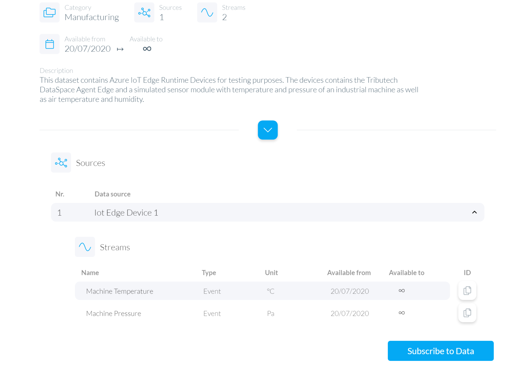
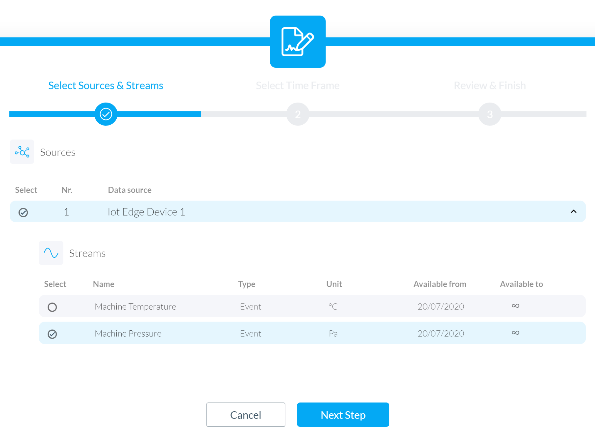
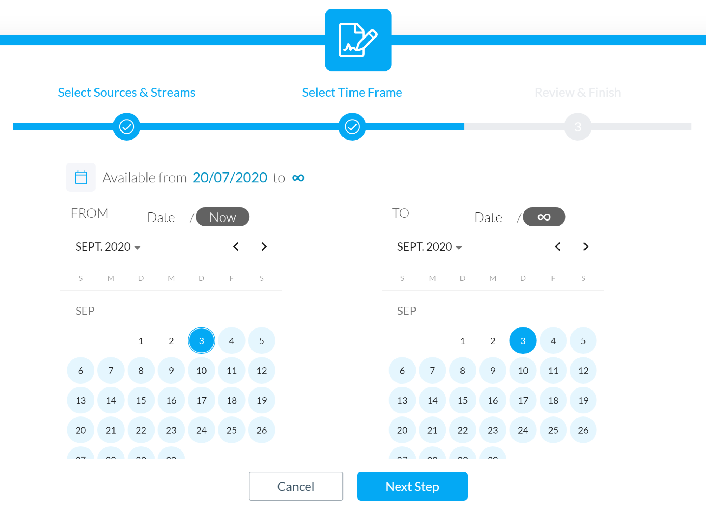
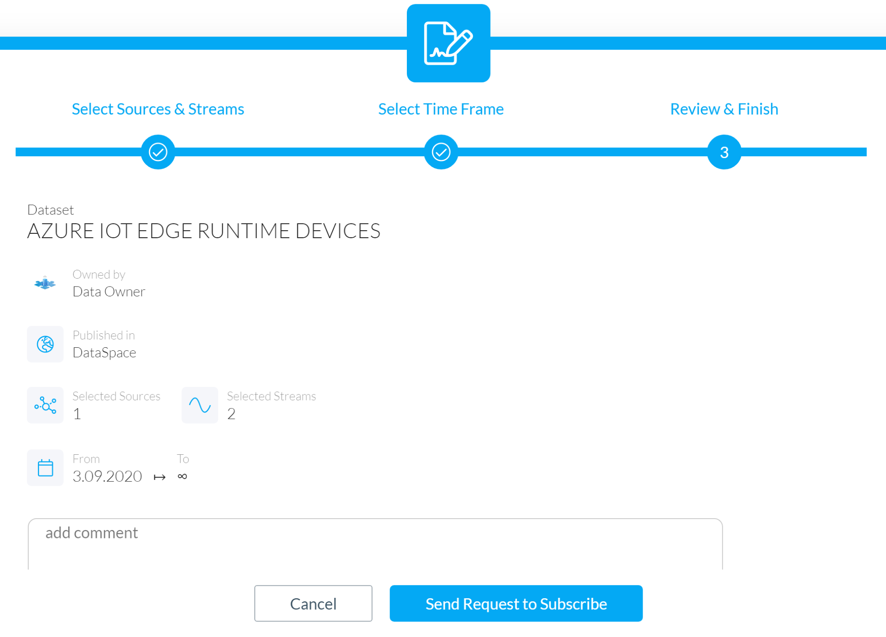
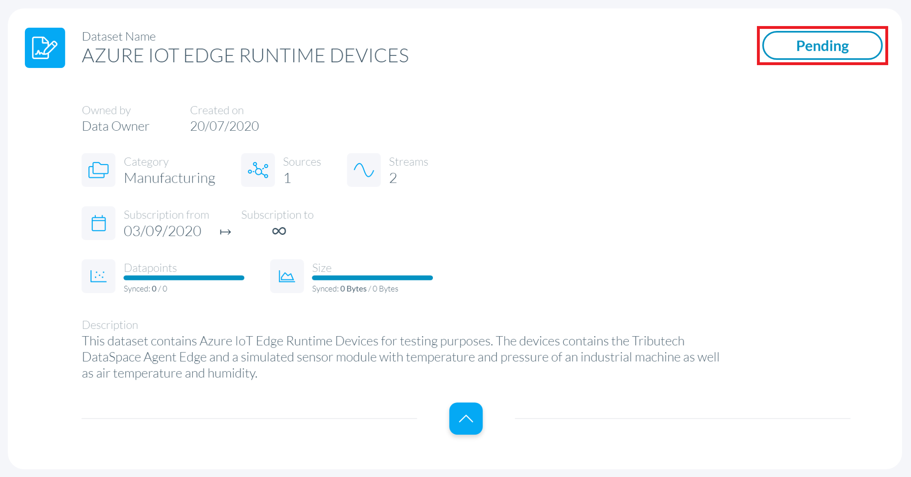

# Request a dataset guide

After the setup of the consumer node is complete, it can subscibe to the dataset that was created before.

## Data preview

In the data preview you can browse through the list of available data sources and streams and view their metadata.

## Configure a Request

### Select sources and streams

Select the sources and stream you want to consume.
>Note: You can selectively choose data streams out of one dataset. You don't have to subscribe to all data streams of a dataset.

### Select a time-frame

Select the time-frame in which you want to subscribe and consume the selected data streams. The dates for **"Available from"** and **"Available to"** of each data stream is also visible via the Request form.

### Accept terms and conditions

If the owner of the dataset has defined terms and conditions of use, you have to agree on before you can send a Request to the owner.

### Send a Request

Once you have selected the data sources and streams of your choice, set the time-frame and agreed to the terms and conditions of use, you can send a Request to the owner of the selected dataset.

## The state of your Subscription

After the Request is sent, a new entry appears in the "Subscriptions" sections of your DataSpace Node. The initial state of this Subscription is "pending" until the owner of the dataset grant or denies your Request.

Once your Request is granted by the owner, the state changes to **granted** and the synchronisation process starts - depending on the selcted time-frame and available data on the owner side.

However, if the owner denies your Request the state of your Subscription changes to "Revoked by Owner".

## Next step: consume a data stream

In this guide, you have learned how to set up a Request for a dataset. To learn more about options of how you can use data of your Subscription, continue with the guide [Data via APIs](/guides/guide-data-via-apis) or [Data via Dashboards](/guides/guide-data-via-dashboards).
