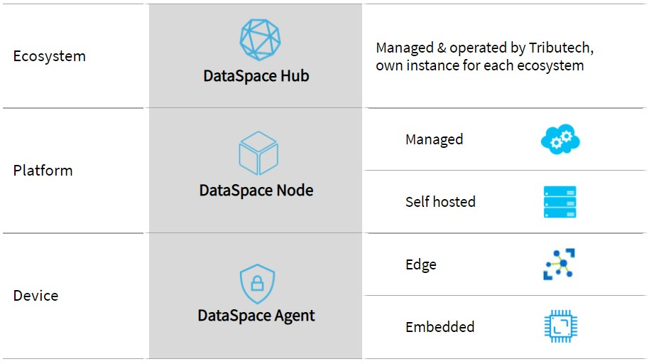

# Overview

This section of the documentation describes how to setup the individual components of the DataSpace Kit (DSK).

The following table overview offers a quick understanding of the components which are at the core of the Tributech DataSpace Kit.

_Fig.1: DataSpace Kit - Components setup variants overview_

If you have never set up the DSK before also check out the [Quick Start Guide](../quickstart/overview.md)

## DSK Ecoystem

The ecosystem consists of the DataSpace Hub and is managed & operated by Tributech. If you want to own an ecosystem, please reach out to us via our [contact form](https://www.tributech.io/about-us/).

## DSK Node

The DataSpace Node serves as a platform and is most likely the part of the architecture that you'll want to setup first. It can either be managed or self-hosted.
Please refer to the [detailed guide for the DSK Node setup](./node/setup-options.md) to learn about its setup and the available setup options.

## DSK Agent

The device that is responsible for transimitting auditable data is the DSK Agent. This device can be an Embedded device or also an Edge device.
Please refer to the [detailed guide for the DSK Agent setup](./agent/setup-options.md) to learn about its setup and the available setup options.

## DSK IoT Hub Bridge

The DSK IoT Hub Bridge connects the Azure IoT Hub to your DSK Node. If you are using the managed variants of the setup options and/or Edge agents, then chances are that you will want to manage the devices through the Azure IoT Hub and thus connect the IoT Hub to your node.
Please follow the [detailed setup guide for the DSK IoT Hub Bridge](./iot-hub-bridge/iot-hub-bridge.md) to learn about how to do that.
